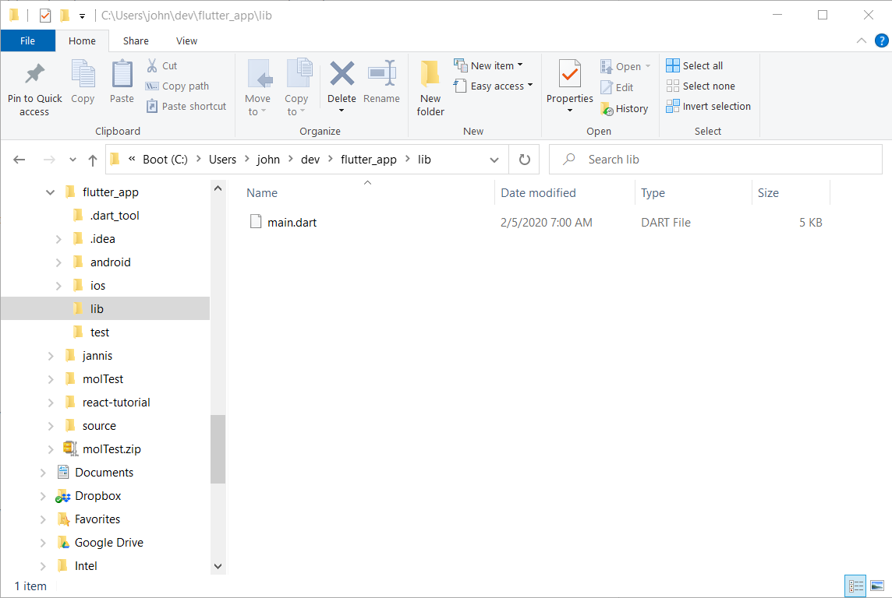

# Flutter-Folders

The Flutter developer tools from Google create a simple folder structure for new Flutter apps as shown in the following figure. The app's main source code file is a file called `main.dart` located in the project's `lib` folder. This approach is great for simple apps, but as soon as you add additional pages to your app, a few classes, and some data services, that `lib` folder gets pretty cluttered.



One approach to for de-cluttering the project is to create separate folders for each type of project file, putting class files in a `class` folder, page files in a `pages` folder, etc. This project provides a simple node module that automatically creates project sub-folders in a Flutter project's `lib` folder. It also creates a higher-level `assets` folder to store image files and other assets used by your application.

## Installing the Module

To install the module, open a terminal window and execute the following command:

```shell
npm install -g flutter-folders
```

## Using the Module

To execute the module open a terminal window, navigate to the Flutter project folder, then execute the following command:

```shell
flutter-folders
```

The module first validates that it's running inside a Flutter project folder, then creates the following folders:

+ `assets`
+ `assets/images`
+ `assets/other`
+ `lib/models`
+ `lib/pages`
+ `lib/services`
+ `lib/utils`
+ `lib/widgets`

With those folders in place, you can now start creating the additional source files your app needs in the appropriate folder based on the file purpose.

A Flutter project won't automatically recognize the assets folders created by this module. To fix this, open the Flutter project's `pubspec.yaml` file and look for the following section:

```yaml
# To add assets to your application, add an assets section, like this:
# assets:
#   - images/a_dot_burr.jpeg
#   - images/a_dot_ham.jpeg
```

Replace that content with the following:

```yaml
# To add assets to your application, add an assets section, like this:
assets:
- assets/images/
- assets/other/
```

This tells Flutter where to look for assets when building the project. 

## Configuring the Module

The module creates the folders listed earlier in this document based on my personal preference for Flutter files. If you want to use different folder names for your project, open this project's `src/flutter-folders.ts` file and modify the `PROJECTFOLDERS` array shown below:

```typescript
const PROJECTFOLDERS: String[] = [
  `assets`,
  `assets/images`,
  `assets/other`,
  'lib/classes',
  `lib/models`,
  `lib/pages`,
  `lib/services`,
  `lib/utils`,
  `lib/widgets`
];
```

Add, remove, or rename folders in the array as needed to customize the module to your particular needs. Keep in mind that you'll need to reapply your changes if you ever install an update to this module.

Notice the source file's extension - it's a `ts` file (TypeScript). Before you can use your modifications, you must compile the TypeScript code into JavaScript. To do this, open a terminal window, navigate to the module folder, and execute the following command:

```shell
npm install -g typescript
```

Next, run the following command:

```shell
tsc
```

This invokes the TypeScript compiler to compile the code into JavaScript. Finally, execute the following command to install the modified module:

```shell
npm install -g
```

This installs the modified module as a  global npm module on your system.
